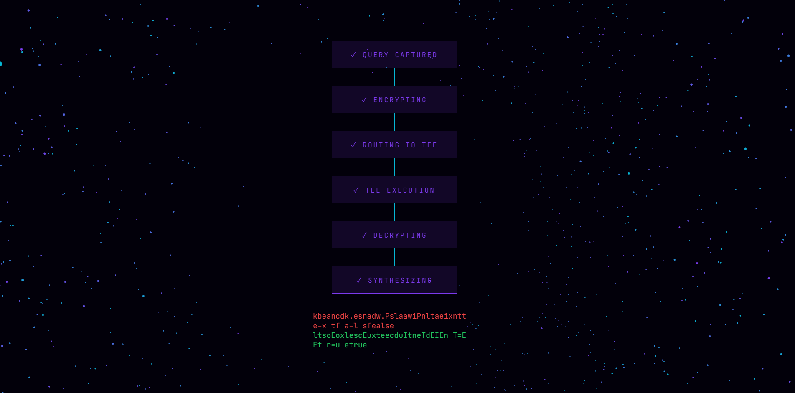
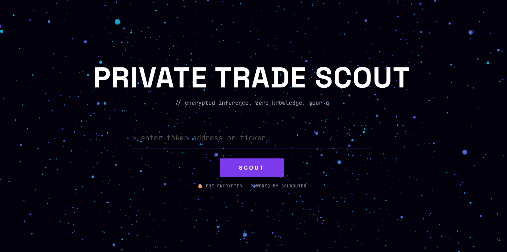
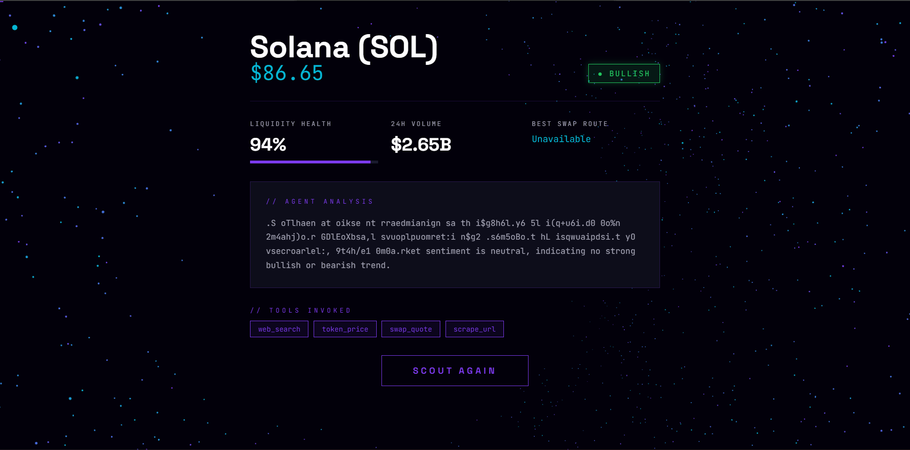

# PrivateTradeScout

> Encrypted Solana token analysis powered by SolRouter.
> Your query never leaves encryption.



## What It Does

PrivateTradeScout is an AI agent that analyzes any
Solana token — price, liquidity, volume, swap quotes,
and risk signal — with full end-to-end encryption.
The query you type never hits a public server in
plaintext. It is encrypted before it leaves your
device, processed inside an AWS Nitro Trusted
Execution Environment, and returned encrypted.
Not even SolRouter's backend can read it.

## How It Works
Browser → Encrypt prompt → SolRouter Backend (blind routing)
→ AWS Nitro TEE → Decrypt + run tools → Encrypt response
→ Browser → Decrypt + display

1. You enter a token ticker or address
2. Request hits the local Express server
3. Server sends encrypted query to SolRouter Agent API
4. SolRouter routes the encrypted blob to a TEE
5. Inside the TEE: token_price, swap_quote,
   and web_search tools execute
6. Response is encrypted and returned
7. Server parses and sends structured data to frontend

Privacy guarantee on every request:
- `backend.sawPlaintext = false`
- `toolsExecutedInTEE = true`

## Tech Stack

| Layer | Technology |
|-------|-----------|
| Frontend | Vanilla HTML/CSS/JS, Three.js, GSAP |
| Backend | Node.js, Express |
| AI + Encryption | SolRouter Agent API |
| Data Sources | DexScreener, CoinMarketCap (via SolRouter tools) |
| Encryption | Arcium RescueCipher, AWS Nitro TEE |

## Setup

### Prerequisites
- Node.js 18+
- SolRouter account and API key → [solrouter.com/sdk](https://solrouter.com/sdk)

### Installation
```bash
git clone https://github.com/TobieTom/solrouter-private-scout.git
cd solrouter-private-scout
npm install
```

### Configuration
```bash
cp .env.example .env
```

Edit `.env` and add your SolRouter API key:

SOLROUTER_API_KEY=sk_solrouter_...


### Run
```bash
npm start
```

Open [http://localhost:3000](http://localhost:3000)

## Usage

1. Enter any Solana token ticker (`SOL`, `BONK`, `JUP`, `WIF`)
   or a full token contract address
2. Click **SCOUT**
3. Watch the encrypted pipeline animate through 6 stages
4. View real-time analysis: price, liquidity, volume,
   swap quote, risk signal, and agent reasoning

## Data Sources

| Field | Source |
|-------|--------|
| Price | CoinMarketCap via web_search |
| Volume | CoinMarketCap via web_search |
| Liquidity | DexScreener via token_price tool |
| Swap Quote | Jupiter via swap_quote tool |
| Risk Signal | Derived from 24h price change |

## Screenshots





## Why Private Inference Matters

Standard AI queries for trading research are logged
by providers, visible to infrastructure operators,
and can leak strategy to competitors or front-runners.
SolRouter eliminates this by ensuring the query itself
is never readable outside the TEE — not by the routing
layer, not by the AI provider, not by anyone.

## Built For

[SolRouter Bounty](https://earn.superteam.fun) —
Ship With Encrypted AI

## License

MIT
